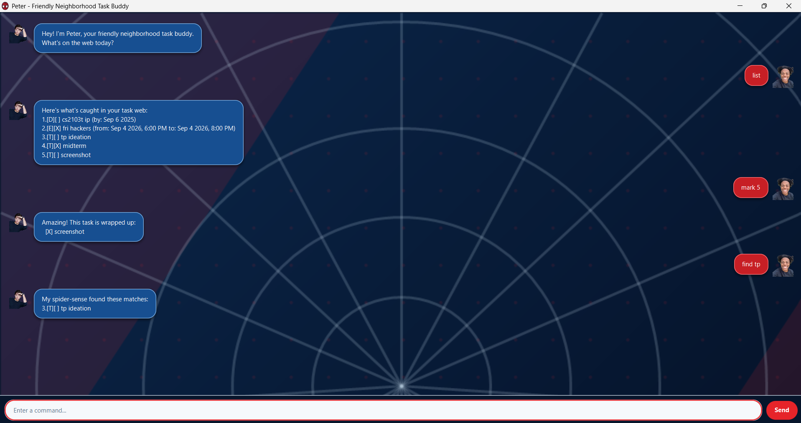

<div align="center">

<h1>🕷️ Peter User Guide</h1>

<p><strong>Your friendly neighbourhood task-tracking chatbot</strong></p>

<p>Keep todos, deadlines, and events organised—one simple command at a time.</p>



</div>

> [!TIP]
> Peter saves every successful change automatically and restores your tasks
> when you return.

---

## 🚀 Quick start

| Command | What it does | Example |
| :--- | :--- | :--- |
| `todo <description>` | Adds a todo | `todo read book` |
| `deadline <description> /by <date>` | Adds a deadline | `deadline submit report /by 2026-09-25` |
| `event <description> /from <start> /to <end>` | Adds an event | `event camp /from 2026-09-25 /to 2026-09-27` |
| `list` | Shows every task | `list` |
| `on <date>` | Shows scheduled tasks on a date | `on 2026-09-25` |
| `find <keywords>` | Searches task descriptions | `find read book` |
| `mark <task-number>` | Marks a task complete | `mark 1` |
| `unmark <task-number>` | Marks a task incomplete | `unmark 1` |
| `delete <task-number>` | Deletes a task | `delete 2` |
| `bye` | Exits Peter | `bye` |

---

## 📖 Command details

### 📝 `todo`

Adds a task without a date or time.

**Format:** `todo <description>`

**Example:** `todo read book`

### ⏰ `deadline`

Adds a task that must be completed by a particular date or time.

**Format:** `deadline <description> /by <date>`

**Example:** `deadline submit report /by 25/9/2026 1800`

### 📅 `event`

Adds a task that takes place over a period. The end cannot be before the start.

**Format:** `event <description> /from <start> /to <end>`

**Example:** `event camp /from 2026-09-25 /to 2026-09-27`

For `deadline` and `event`, enter dates as `yyyy-MM-dd` or `d/M/yyyy HHmm`.
For example, `2026-09-25` is a date, while `25/9/2026 1800` includes a time.

### 📋 `list`

Shows every task and its current task number.

**Format:** `list`

```text
1.[T][ ] read book
2.[D][X] submit report (by: Sep 25 2026, 6:00 PM)
```

`[T]`, `[D]`, and `[E]` mean todo, deadline, and event. `[ ]` means
incomplete, while `[X]` means complete.

### 🗓️ `on`

Shows deadlines due on a date and events that include that date. Todos are not
shown because they have no schedule.

**Format:** `on <yyyy-MM-dd>`

**Example:** `on 2026-09-25`

### 🔎 `find`

Searches task descriptions. The search ignores case and matches partial words.
Every keyword must appear, but the keywords can appear in any order.

**Format:** `find <keywords>`

**Example:** `find read book`

### ✅ `mark`

Marks a task as complete using its task number.

**Format:** `mark <task-number>`

**Example:** `mark 1`

### ↩️ `unmark`

Marks a completed task as incomplete.

**Format:** `unmark <task-number>`

**Example:** `unmark 1`

### 🗑️ `delete`

Permanently removes a task. Task numbers may change after deletion, so use
`list` again before updating another task.

**Format:** `delete <task-number>`

**Example:** `delete 2`

### 👋 `bye`

Exits Peter. Your tasks are already saved.

**Format:** `bye`
